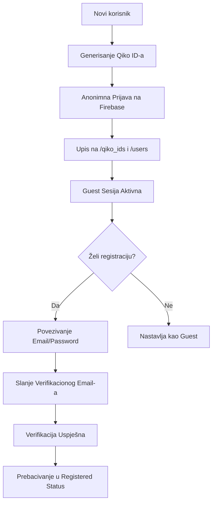

# Qiko Chat - Kompletan Vodič kroz Arhitekturu, Logiku i Integraciju

Ovaj dokument detaljno opisuje tehničku arhitekturu, sigurnosne protokole i inženjerska rješenja implementirana u Qiko chat sistemu (kako u Chrome ekstenziji, tako i u samostalnoj web aplikaciji).

---

## 1. Filozofija i Core koncept
Qiko je dizajniran kao **zero-footprint peer-to-peer (P2P)** messenger za razmjenu poruka bez zadržavanja podataka na serverima.
- **Bez trajnog skladištenja poruka na serveru**: Poruke se privremeno upisuju u bazu i odmah brišu čim ih primalac preuzme.
- **Klijentska istorija**: Istorija ćaskanja se čuva isključivo lokalno u pretraživaču primaoca i pošiljaoca (ograničeno na zadnjih 100 poruka kako bi se spriječilo zagušenje memorije).
- **Hibridni model**: Isti kod pokreće i Chrome ekstenziju i samostalnu web aplikaciju (`/chat` ruta).

---

## 2. P2P Signalizacija i Model Poruka (Inbox Queue)

Pošto pretraživači nemaju direktan način za slanje poruka ugašenim peer-ovima bez posrednika, Qiko koristi Firebase Realtime Database (RTDB) kao ultralaku, prolaznu poštu (Queue).

### Slanje poruke (`popup.js` / `dashboard.astro`)
Kada korisnik A šalje poruku korisniku B:
1. **Pronalaženje UID-a**: Provjerava se mapiranje Qiko ID-a korisnika B na Firebase UID preko putanje `/qiko_ids/${recipient_id}.json`.
2. **Upis u Inbox**: Šalje se `POST` zahtjev na `/inbox/${recipient_uid}.json` sa tijelom poruke, ID-jem pošiljaoca i vremenskim pečatom.
3. **Lokalni log**: Poruka se odmah upisuje u lokalni storage pošiljaoca pod ključem `qiko_history_${recipient_id}`.

### Primanje i brisanje poruka (`background.js` / `background-adapter.js`)
Klijent konstantno sluša dolazne događaje na svojoj putanji `/inbox/${my_uid}.json`:
1. **SSE Stream (Server-Sent Events)**: Otvara se trajna HTTP konekcija (`Accept: text/event-stream`).
2. **Preuzimanje i skladištenje**: Kada stigne nova poruka, klijent je dekodira, upisuje u lokalni storage pod istoriju pošiljaoca, i (opciono) prikazuje sistemsku notifikaciju ako je prozor minimiziran/zatvoren.
3. **Brzo brisanje (Zero Footprint)**: Klijent odmah šalje `DELETE` zahtjev na `/inbox/${my_uid}/${msg_id}.json`. Poruka se briše sa Firebase servera u djeliću sekunde nakon što je isporučena.

---

## 3. Upravljanje Identitetom i Autentifikacija

Qiko koristi Firebase Authentication u kombinaciji sa RTDB-om za kreiranje sigurnih, jedinstvenih identiteta.



### Anonimna prijava (Guest)
Čim korisnik uđe u proces generisanja Qiko ID-a, sistem ga anonimno prijavljuje na Firebase Auth. Ovo omogućava da klijent dobije validan sigurnosni token (`idToken`) *prije* bilo kakvog upisa u bazu, čime se poštuju stroga sigurnosna pravila baze podataka (`auth != null`).

### Upgrade na Email/Lozinku
Kada anonimni korisnik odluči da osigura svoj profil:
1. Unosi Email, Lozinku i Korisničko ime.
2. Poziva se `firebaseLinkEmail` koji povezuje email kredencijale sa postojećim anonimnim nalogom (zadržavajući isti Qiko ID i istoriju).
3. Šalje se verifikacioni email. Korisnik se preusmjerava na ekran za verifikaciju.

### Cancel i Unlink Logika
Ako korisnik odustane na ekranu za verifikaciju i klikne "Nazad":
- Poziva se `firebaseUnlinkEmail` da se email odveže od anonimnog naloga. Ovo sprečava da email ostane blokiran ili u polu-povezanom stanju, omogućavajući korisniku da se bez greške registruje ponovo sa istim emailom.

---

## 4. Prisustvo (Presence) i Statusi

Prisustvo korisnika (Online/Offline) se prati dinamički pomoću vremenskih pečata.
- **Heartbeat petlja**: Svakih 30 sekundi (ili 60 sekundi u ekstenziji), pozadinski proces šalje `PUT` zahtjev sa trenutnim `Date.now()` na `/users/${uid}/last_seen.json`.
- **Provjera statusa**: Kada klijent renderuje kontakte, povlači njihove `last_seen` vrijednosti. Ako je razlika između trenutnog vremena i `last_seen` manja od 2 minuta (120,000 ms), kontakt se prikazuje kao **Online** (zeleni indikator); u suprotnom je **Offline** (sivi indikator).
- **Brzo odjavljivanje**: Prilikom klika na *Sign Out*, klijent eksplicitno postavlja `last_seen` na `0` u bazi, čime ga svi kontakti istog trena vide kao offline bez čekanja timeout-a.

---

## 5. Hibridni Sloj: Chrome Ekstenzija vs. Web Aplikacija

Jedan od najvećih izazova pri portovanju Qiko ekstenzije na Web bio je nedostatak trajnog pozadinskog procesa (`background service worker`) i `chrome.storage` API-ja u običnom browseru. Riješili smo to kroz dva modula:

### A) Jedinstveni Storage Helper (`storage-helper.js`)
Ovaj modul služi kao wrapper koji simulira ponašanje ekstenzije:
- **Fallback**: Ako `chrome.storage.local` ne postoji, podaci se upisuju u standardni `localStorage`.
- **Mocking Događaja**: Implementira `storage.onChanged.addListener()`. Kada bilo koji dio aplikacije pozove `storage.set()`, `storage.remove()`, ili `storage.clear()`, helper ručno okida registrovane callback funkcije sa `{ oldValue, newValue }` promjenama. Ovo omogućava da 60 KB UI koda u `popup.js` radi bez ikakvih modifikacija.

### B) Klijentski Background Adapter (`background-adapter.js`)
Pošto web stranica ne može imati trajno aktivan Service Worker u pozadini dok je tab zatvoren, logika za SSE stream i ažuriranje prisustva je prebačena u klijentski adapter:
- **Životni vijek**: Pokreće se čim se otvori `/chat/dashboard` stranica u browseru.
- **SSE Stream**: Otvara i drži konekciju prema Firebase RTDB-u dok je tab aktivan.
- **Token Refresh**: Ako Firebase vrati HTTP `401 Unauthorized` grešku za stream, adapter automatski šalje zahtjev na Google Secure Token API, osvježava `idToken` koristeći `refresh_token`, spašava ga u storage (što automatski ažurira UI) i ponovo pokreće stream bez prekidanja korisničkog iskustva.

---

## 6. Sigurnosna pravila baze podataka (Security Rules)
Firebase Realtime Database je konfigurisan tako da niko ne može čitati ili pisati podatke bez validne autentifikacije. Pravila zahtijevaju da svaki REST poziv sadrži `?auth=${token}` parametar:

```json
{
  "rules": {
    "users": {
      "$uid": {
        ".read": "auth != null",
        ".write": "auth != null && auth.uid == $uid"
      }
    },
    "qiko_ids": {
      ".read": "auth != null",
      "$qiko_id": {
        ".write": "auth != null"
      }
    },
    "inbox": {
      "$uid": {
        ".read": "auth != null && auth.uid == $uid",
        ".write": "auth != null"
      }
    }
  }
}
```
Ova struktura osigurava da:
- Korisnik može pisati isključivo u svoj `/users/${uid}` profil i čitati samo iz svog `/inbox/${uid}` sandučeta.
- Svako može poslati poruku u tuđi `/inbox/${uid}` (zahtijeva se samo da pošiljalac ima aktivan nalog, tj. `auth != null`).
