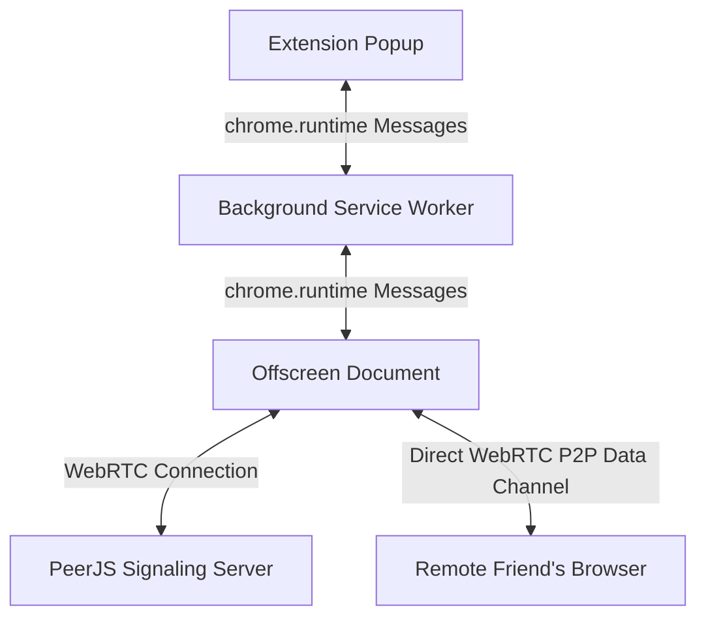
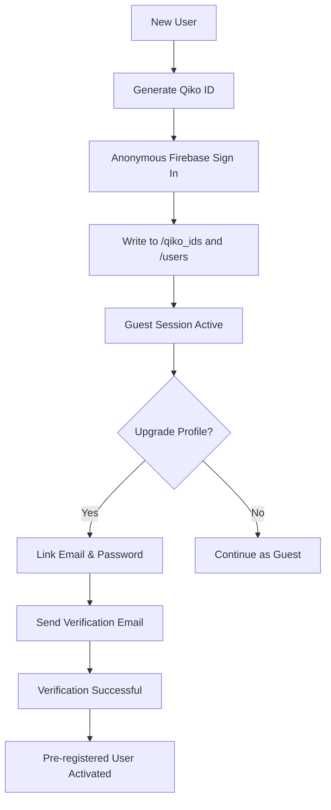

# Qiko Chat - Architecture, Logic, and Integration Guide

This document describes the technical architecture, security protocols, and engineering solutions implemented in the Qiko chat system (specifically for the Chrome extension using ES6 modules).

---

## 1. Philosophy and Core Concept
Qiko is a **zero-footprint peer-to-peer (P2P)** messenger designed for direct, serverless communication without storing message data on any servers.
- **Serverless Message Flow**: Messages are sent directly from browser to browser using WebRTC (via PeerJS). No messages are stored in any database or intermediary server.
- **Client-Side History**: Chat history is kept strictly in local storage (`chrome.storage.local`) on the sender's and receiver's devices, capped at the last 100 messages per conversation to prevent storage bloat.
- **Clean ES6 Architecture**: The extension is modularized into dedicated controllers and services, avoiding monolithic files and hardcoded values.

---

## 2. P2P Messaging Architecture & WebRTC (PeerJS)

Since Chrome Extension service workers (`background.js`) do not support APIs like `RTCPeerConnection` or `navigator.mediaDevices` directly, Qiko utilizes the **Chrome Offscreen API** to host the WebRTC connection layer persistently in the background.



### Flow of Message Exchange:
1. **Target Lookup**: When user A initiates a connection to user B, the system queries the Firebase Realtime Database at `/qiko_ids/${recipient_id}.json` to retrieve user B's Peer ID (which is mapped to their Firebase UID).
2. **Offscreen Bridge**: The Popup sends a message to `background.js`, which forwards it to the active Offscreen document (`offscreen.html`/`offscreen.js`).
3. **P2P Connection**: The Offscreen document establishes a direct WebRTC Data Connection (`PeerJS`) to the recipient.
4. **Data Transmission**: Messages are transmitted directly over the secure P2P data channel. Once received, the Offscreen document:
   - Updates `chrome.storage.local` with the new message in the conversation history log.
   - Dispatches a message back to the Popup (if open) to update the chat UI in real-time.
   - Dispatches a notification request to the Background script to display a toast or fallback notification to the user.

---

## 3. Identity Management and Authentication

Qiko integrates Firebase Authentication with the Realtime Database to create secure, unique user identities.



### Anonymous Login (Guest Status)
To comply with strict security rules (`auth != null` required to write/read), Qiko automatically performs an anonymous sign-in via Firebase Auth before saving the generated Qiko ID. This yields a valid security token (`idToken`) for database write authentication.

### Upgrading to Email & Password
When a guest decides to secure their profile:
1. They enter an email, password, and display name.
2. The client calls `firebaseLinkEmail` to link the email credentials to the existing anonymous credentials (preserving the generated Qiko ID and message history).
3. A verification email is sent, and the user is redirected to the verification panel.

### Verification Flow & Clean Rollback (Unlinking)
If a user cancels the registration on the verification screen:
- The system calls `firebaseUnlinkEmail` to decouple the email from the anonymous credential. This prevents the email from becoming locked in a half-verified state, allowing the user to attempt registration again with the same email.

---

## 4. Presence and Online Status Tracking

User presence (Online/Offline status) is tracked dynamically using active heartbeats and timestamps in the Firebase Realtime Database.
- **Heartbeat Ping**: A background task pings the database every 60 seconds by updating the user's `last_seen` timestamp (`/users/${uid}/last_seen.json`) with `Date.now()`.
- **Online/Offline Checking**: When rendering contacts, the UI manager fetches their `last_seen` timestamps. If the difference between the current time and `last_seen` is less than 120 seconds (2 minutes), the contact is shown with a green **Online** status indicator; otherwise, it is shown as **Offline** (grey indicator).
- **Explicit Sign Out**: When a user signs out, the client explicitly sets their `last_seen` to `0`, ensuring they immediately appear offline to all connected contacts.

---

## 5. Smart In-Page Toast Notifications

To provide a premium and non-intrusive notifications experience:
1. **Webpage Toast Injections (`content.js`)**: When a message is received while the extension popup is closed, the background script queries the active tab and sends a message to inject a custom, themed toast notification (`content.js`).
   - The toast features a sleek retrowave/cyberpunk layout.
   - Clicking the toast triggers an `'OPEN_POPUP'` message to the background service worker, opening the extension popup directly.
   - It automatically dismisses after 6 seconds with a smooth slide-out animation.
2. **System Notification Fallback**: If the active browser tab is a restricted internal page (e.g. `chrome://extensions/`, `chrome://settings/`, or Chrome Web Store) where Chrome blocks content scripts for security reasons, the extension falls back to a standard system notification (`chrome.notifications.create`).
3. **Nord Dynamic Theming**: The background script forwards the user's active theme setting (`light`, `dark`, or `system`). The content script dynamically applies the exact colors from the Nord palette:
   - **Dark Nord:** Background `#2e3440`, accent `#88c0d0`, text `#eceff4`, muted text `#d8dee9`.
   - **Light Nord:** Background `#eceff4`, accent `#5e81ac`, text `#2e3440`, muted text `#4c566a`.

---

## 6. Database Security Rules

Firebase Realtime Database enforces secure read/write rules. Every HTTP REST or Websocket connection must be authenticated:

```json
{
  "rules": {
    "users": {
      "$uid": {
        ".read": "auth != null",
        ".write": "auth != null && auth.uid == $uid"
      }
    },
    "qiko_ids": {
      ".read": "auth != null",
      "$qiko_id": {
        ".write": "auth != null"
      }
    }
  }
}
```

This ensures:
- Only authenticated users (`auth != null`) can look up profiles or resolve Qiko IDs.
- A user can only write to their own profile node under `/users/${uid}`.
